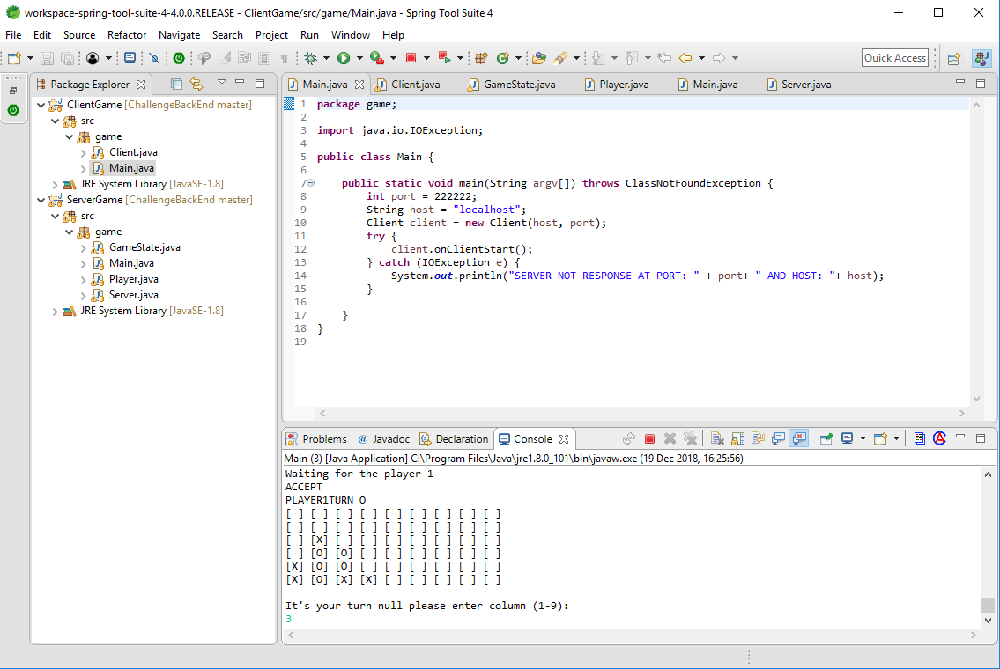
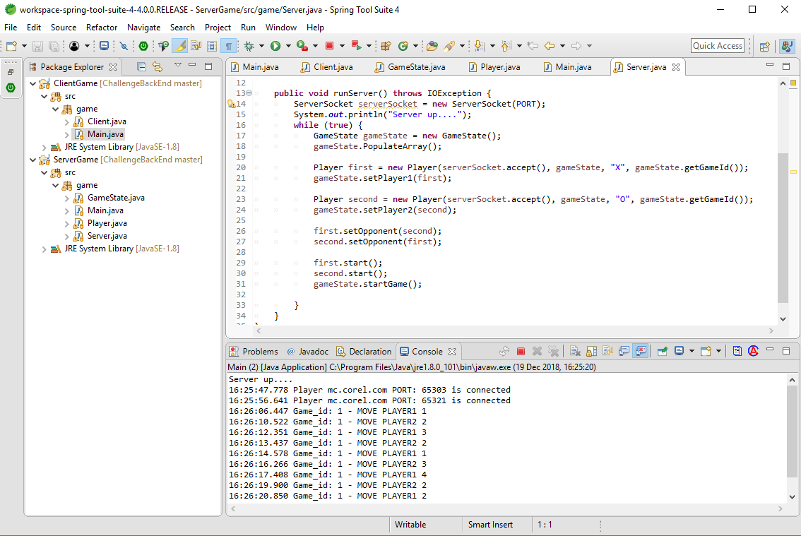

# 5-in-a-Row
## Java Socket Programming – Socket Server and Client.

### Client

### Server

### IDE - Development environment
- Spring Tools Suite 4

### Language
- Java

## Author
### Alexander Souza
- alexpt2000@gmail.com
- https://github.com/alexpt2000
- www.linkedin.com/in/souza-alexander

